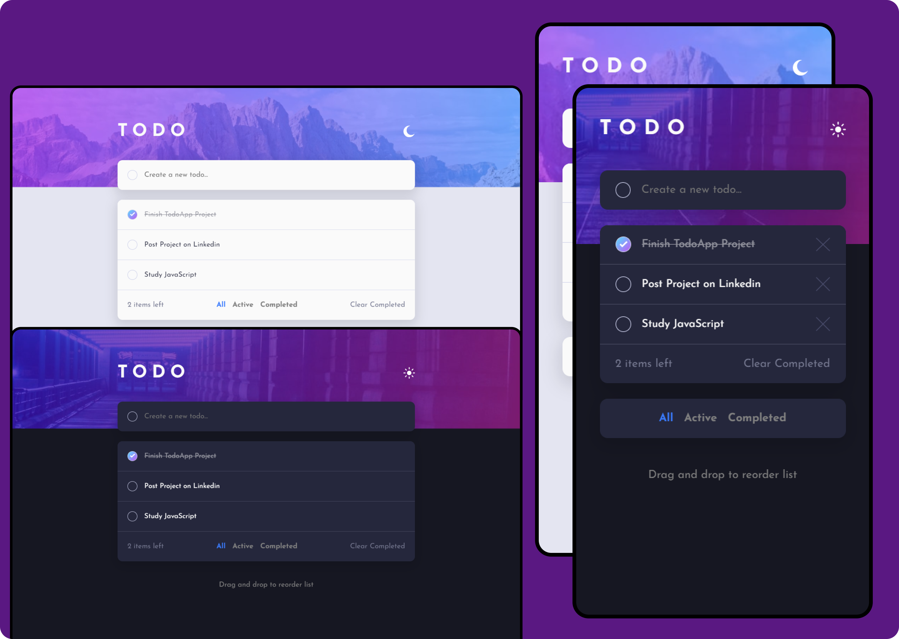

# TodoApp

This project consists of a responsive TodoApp with many functionalities as listed below:

- See hover states for all interactive elements on the page
- Add new to-dos to the list
- Mark to-dos as complete
- Delete to-dos from the list
- Filter by all/active/complete to-dos
- Clear all completed to-dos
- Toggle light and dark mode
- Drag and drop to reorder items on the list
- Build this project as a full-stack application

<h3>Deployment Link</h3>
https://todo-app-one-brown.vercel.app/

<!-- The project idea and design was proposed by Frontend Mentor and developed by me. -->

## Screenshot

## This project was developed with

- HTML
- CSS
- JavaScript
<!-- - [Sortable Library](https://sortablejs.github.io/Sortable/) -->

## Author

- [@thesarfo](https://github.com/thesarfo)

